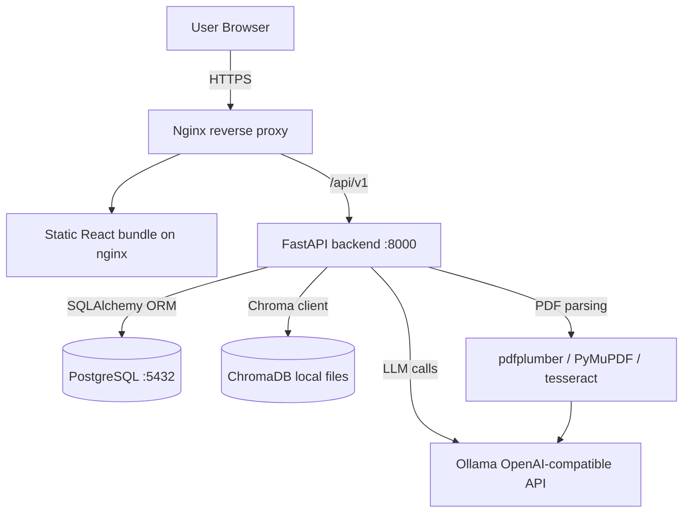

# NutriTrack

A RAG-based personal nutrition dashboard. Upload product PDFs, log meals in natural language, and track your daily macros and micronutrients.

## Architecture



## Quick Start

### Prerequisites
- Docker & Docker Compose
- Docker Desktop healthy enough to start Linux containers
- Ollama running on the host machine with the configured model available
- At least 4 GB RAM recommended for PostgreSQL, the API process, and the embedding model

Example host setup:

```bash
ollama serve
ollama pull llama3.2:3b
```

### Setup

```bash
# 1. Clone / copy the project
cd nutritrack

# 2. Create your .env file
cp .env.example .env
# Edit .env if you want to change OLLAMA_MODEL or OLLAMA_BASE_URL for local runs

# 3. Start the production profile through nginx
docker compose --profile production up --build

# Services will be available at:
#   App:       https://localhost
```

`docker-compose.yml` builds the frontend as a static production bundle, serves it with nginx, and keeps the backend/frontend container ports internal. The backend reaches Ollama at `http://host.docker.internal:11434/v1`.

For local development without TLS, set `APP_ENV=development` and `COOKIE_SECURE=false` in `.env`, then run backend/frontend dev servers directly. Do not use Vite's dev server for public traffic.

The backend runs `seed.py` only when `APP_ENV=development`, creating a demo user and 3 example products:

| Email | Password |
|---|---|
| demo@nutritrack.app | `SEED_DEMO_PASSWORD` or `nutritrack-dev-only-change-me` |

## Production Notes

- Keep `COOKIE_SECURE=true` and configure real TLS certificates in `nginx/certs`.
- Configure `PUBLIC_APP_URL` and SMTP settings so password reset emails can be delivered.
- The compose file runs one API worker because local persistent ChromaDB is not safe for multi-process writes. Move to a Chroma server or another networked vector store before scaling API replicas.
- Run database migrations as a separate deployment job before using multiple backend replicas.
- Back up both PostgreSQL and the Chroma data volume.

## API Documentation

FastAPI auto-generates interactive docs at **http://localhost:8000/docs** (Swagger UI) and **http://localhost:8000/redoc**.

### Key endpoints

| Method | Path | Description |
|---|---|---|
| POST | `/api/v1/auth/register` | Create account, returns JWT |
| POST | `/api/v1/auth/login` | Login, returns JWT |
| GET | `/api/v1/auth/me` | Current user info |
| POST | `/api/v1/profile` | Create user profile + targets |
| GET | `/api/v1/profile` | Get profile + calculated targets |
| PATCH | `/api/v1/profile` | Update profile |
| GET | `/api/v1/profile/targets` | Get effective daily targets |
| POST | `/api/v1/products/extract` | Upload PDF → AI extraction preview |
| POST | `/api/v1/products` | Save confirmed product |
| GET | `/api/v1/products` | List user's products |
| DELETE | `/api/v1/products/{id}` | Delete product |
| POST | `/api/v1/meals/parse` | NL text → parsed items + RAG candidates |
| POST | `/api/v1/meals` | Save confirmed meal entry |
| GET | `/api/v1/meals/today` | Today's meal entries |
| GET | `/api/v1/meals/daily-totals` | Nutrient totals for a date |
| GET | `/api/v1/meals/weekly-totals` | 7-day history array |
| DELETE | `/api/v1/meals/{id}` | Delete meal entry |

All protected endpoints require `Authorization: Bearer <token>`.

## Nutrition Calculation

Uses the **Mifflin-St Jeor** equation for BMR:

- **Male:** `10w + 6.25h − 5a + 5`
- **Female:** `10w + 6.25h − 5a − 161`
- **Other:** average of male/female

TDEE = BMR × activity multiplier, then adjusted by goal:

| Goal | Adjustment | Macro split (P/C/F) |
|---|---|---|
| Maintain | ±0 kcal | 30 / 40 / 30 % |
| Cut | −500 kcal | 40 / 30 / 30 % |
| Bulk | +300 kcal | 25 / 50 / 25 % |

## Running Tests

```bash
cd backend
pip install -r requirements.txt
pytest tests/ -v
```

```bash
cd frontend
npm install
npm run lint
npm run build
npm run test:e2e
```

The smoke e2e suite expects the app stack to already be running at `http://127.0.0.1:5173` unless `PLAYWRIGHT_BASE_URL` is set.

## End-to-End Notes

- Core auth, profile setup, dashboard, and seeded products are covered by smoke e2e tests.
- AI-dependent flows such as PDF extraction and meal parsing are still manual checks because they depend on host Ollama availability.
- If Docker Desktop cannot start the Linux engine, fix that host issue first; the repo cannot compensate for a broken Docker engine.

## Project Structure

```
nutritrack/
├── backend/
│   ├── app/
│   │   ├── api/          # FastAPI routers (auth, profile, products, meals)
│   │   ├── core/         # config, security, DB session
│   │   ├── models/       # SQLAlchemy models
│   │   ├── schemas/      # Pydantic schemas
│   │   └── services/     # nutrition_calc, pdf_extraction (Ph2), rag (Ph3)
│   ├── tests/
│   ├── seed.py           # Demo data seeder
│   └── Dockerfile
├── frontend/
│   ├── src/
│   │   ├── api/          # Axios API clients
│   │   ├── components/   # Layout, ProtectedRoute
│   │   ├── hooks/        # Zustand auth store
│   │   ├── pages/        # Login, Register, Profile, Dashboard
│   │   └── types/        # Shared TypeScript interfaces
│   └── Dockerfile
├── docker-compose.yml
├── .env.example
└── README.md
```

## Build Phases

| Phase | Scope | Status |
|---|---|---|
| 1 | Scaffolding, auth, profile, BMR calculation | ✅ Complete |
| 2 | PDF upload + AI extraction pipeline | ✅ Complete |
| 3 | Natural-language meal logging + RAG retrieval | ✅ Complete |
| 4 | Dashboard today view + weekly trends | ✅ Complete |
| 5 | Polish, error states, 44 tests, DEMO.md | ✅ Complete |
