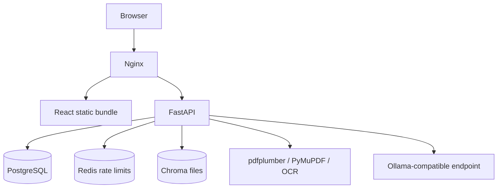

# NutriTrack

NutriTrack is a personal nutrition tracker with product PDF extraction, natural-language meal logging, and daily/weekly macro tracking.

## Architecture



## Production

Production defaults target Docker Compose behind the included nginx reverse proxy.

```bash
cp .env.production.example .env
# Fill every blank value. Generate SECRET_KEY with: openssl rand -hex 32
docker compose up --build
```

Production startup fails if unsafe settings are detected: development secrets, insecure cookies, localhost/wildcard CORS, missing SMTP/public URL, missing Redis rate-limit storage, local LLM URL, or default database passwords.

Postgres is not published to the host in production. nginx maps host `80` to container `8080` and host `443` to container `8443` so the proxy can run as an unprivileged user.

## Local Development

```bash
cp .env.development.example .env
docker compose -f docker-compose.dev.yml up --build
```

The development stack may use insecure cookies, localhost CORS, memory rate limits, and demo seeding. Do not use it for public traffic.

Demo credentials:

| Email | Password |
|---|---|
| demo@nutritrack.app | `SEED_DEMO_PASSWORD` or `nutritrack-dev-only-change-me` |

## Auth

Browser auth is cookie-only. `/auth/register`, `/auth/login`, and `/auth/refresh` set httpOnly cookies and return session/user metadata. Bearer tokens are still accepted inbound as an API/test fallback.

## API Notes

- Profiles include an IANA `timezone`.
- Meal day/today/weekly endpoints accept optional `timezone`.
- Product and meal list endpoints support `skip`, `limit`, and search/date filters.
- `GET /api/v1/users/me/export` exports account data.
- `DELETE /api/v1/users/me` permanently deletes the account and associated data.

## Tests

Backend:

```bash
cd backend
pip install -r requirements.txt
pytest
pip check
pip-audit -r requirements.txt
```

Frontend:

```bash
cd frontend
npm ci
npm run lint
npm run build
npm run test:e2e
```

Playwright starts the Vite web server automatically unless `PLAYWRIGHT_BASE_URL` is set. Browser tests still require a reachable backend; CI starts the backend stack first.

## Release Hygiene

Generated artifacts such as `node_modules`, `dist`, `test-results`, `__pycache__`, virtualenvs, runtime data, and local env files are ignored and excluded from Docker build contexts.
